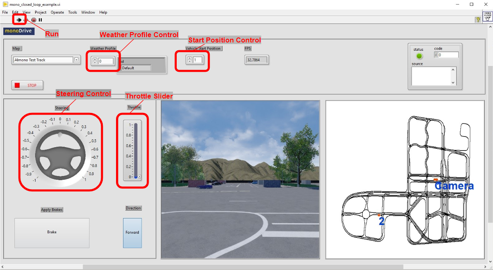
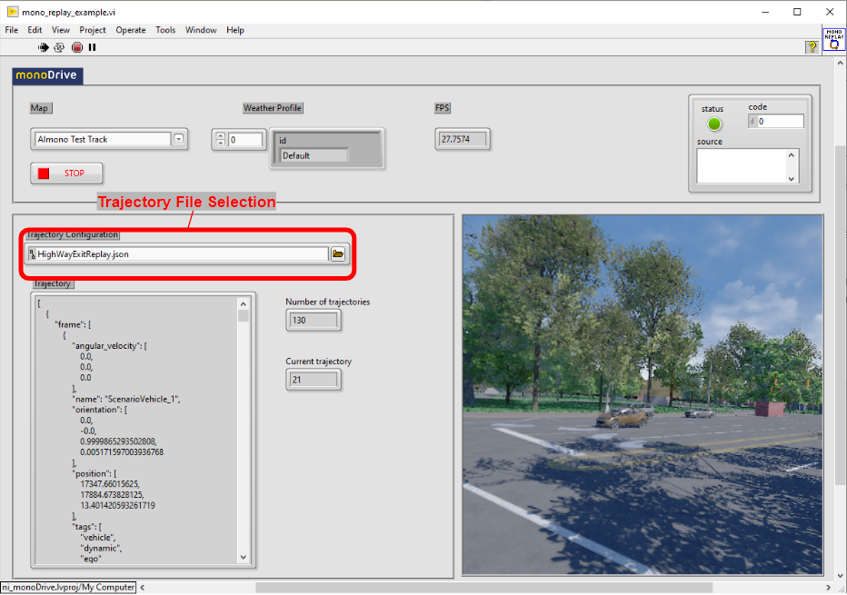
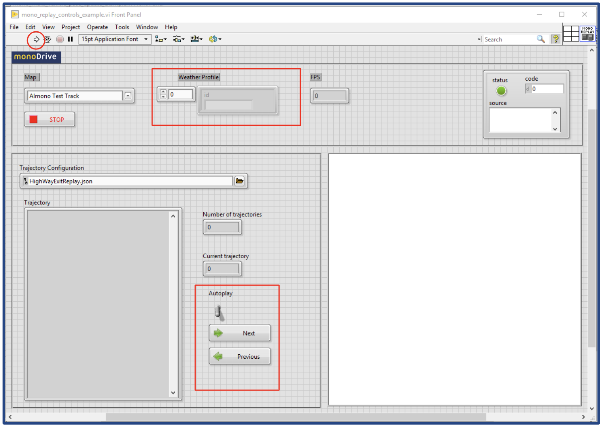
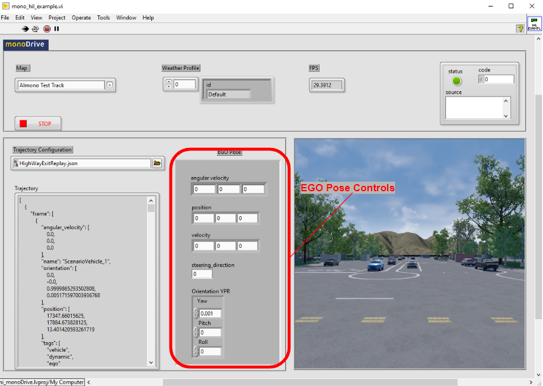
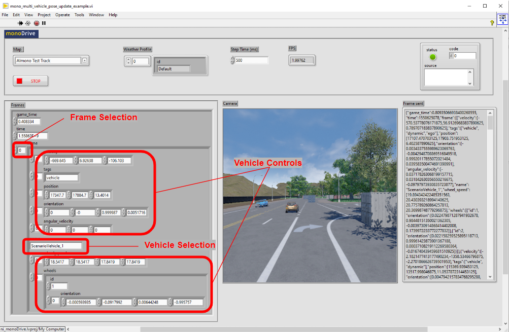
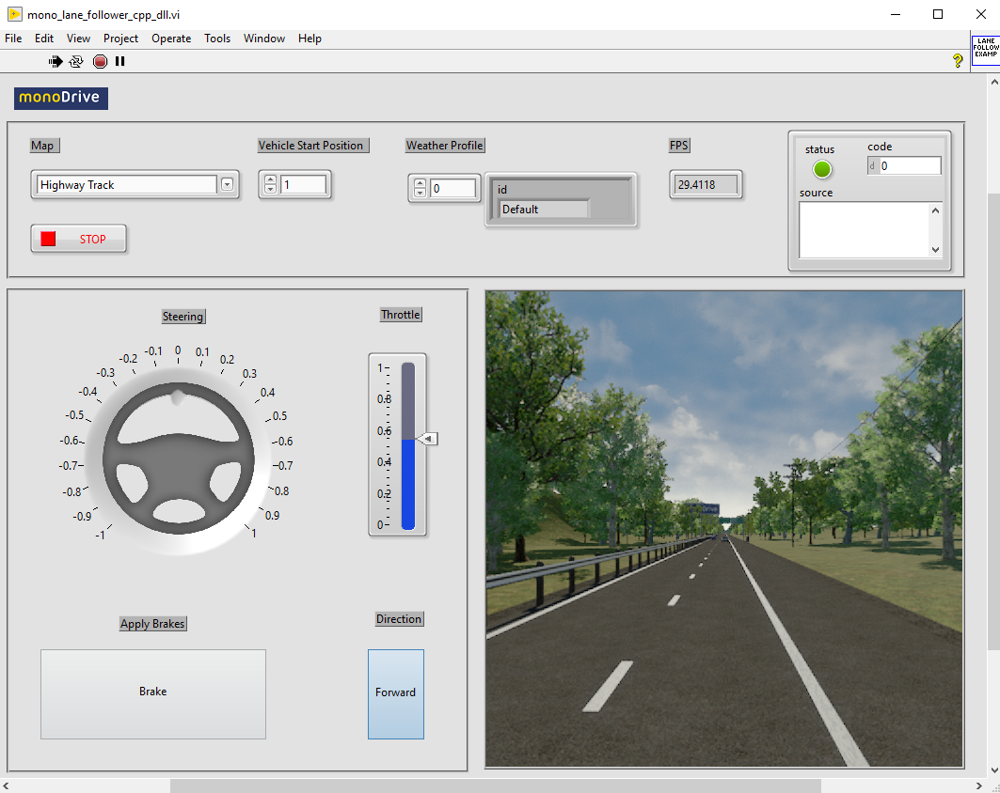
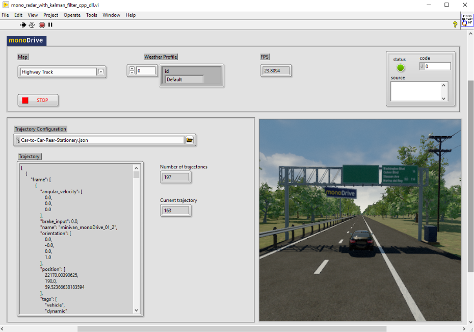

## Run the monoDrive Client- Examples

After installing the monoDrive Client from the VI package manager, several
pre-built examples will be available through the Help -> Find Examples dialog
in LabView. The `ni_monoDrive.lvproj` contains references to all the VIs 
described here.

### Closed Loop Example

The Closed Loop example allows the user to control the vehicle's steering, 
throttle, brakes, and simulation weather in real time. To run the example:

1. Click on the arrow on the top-left corner to start the client.

2. Move the car using the Steering and Throttle controls.

3. Change the direction of the car using the forward control.

4. Apply brakes using the Brake control.

5. Change the Weather profile using the up and down control.

6. Select a different position to start if desired.

    

&nbsp;

### Replay Example

1. Click on the arrow on the top-left corner to start the client.

2. Change the Weather profile using the up and down control.

3. Use the browser button to find other scenarios, you can find them typically on:

    *C:\Program Files\National Instruments\LabVIEW 2019\vi.lib\monoDrive\monoDriveClient\labview\trajectories*

    

&nbsp;

### Replay Controls

1. Click on the arrow on the top-left corner to start the client.

2. By default the Autoplay will be set to False. Click on the Next button to see the first frame on the trajectory.

3. Click on Previous to go back one frame on the trajectory.

4. Change the Weather profile using the up and down control.

5. Use the browser button to find other scenarios, you can find them typically on:
*C:\Program Files\National Instruments\LabVIEW 2019\vi.lib\monoDrive\monoDriveClient\labview\trajectories*

    

&nbsp;

### HIL Example

1. Click on the arrow on the top-left corner to start the client.

2. Change the Weather profile using the up and down control.

3. This example is meant to be used with Veristand or other real-time hardware.

4. Use the browser button to find other scenarios, you can find them typically on:
*C:\Program Files\National Instruments\LabVIEW 2019\vi.lib\monoDrive\monoDriveClient\labview\trajectories*

    

&nbsp;

### Multi Vehicle Pose Update Example

1. Click on the arrow on the top-left corner to start the client.

2. You will see the EGO vehicle moving as well other vehicles according to the Frames configuration.  

3. On the block diagram is explained how to replace 

    

&nbsp;

### Lane Follower Example.
This example is in experimental stage.

1. Make sure you build the Lane Follower dll, following the instruction on the README.md found on the “experimental” directory

2. Click on the arrow on the top-left corner to runt the client.

3. You will see the ego vehicle moving on the right-lane of the Highway Track.

    

&nbsp;

### Radar with Kalman Filter Example
This example is in experimental stage.

1. Make sure you build the Kalman Filter dll, following the instruction on the README.md found on the “experimental” directory.

2. Click on the arrow on the top-left corner to runt the client.

3. You will see the ego vehicle following the trajectory defined on the Car-to-Car-Stationary.json file.

4. On the Block Dia

    

For technical support contact us at <b>support@monodrive.io</b>

&nbsp;
