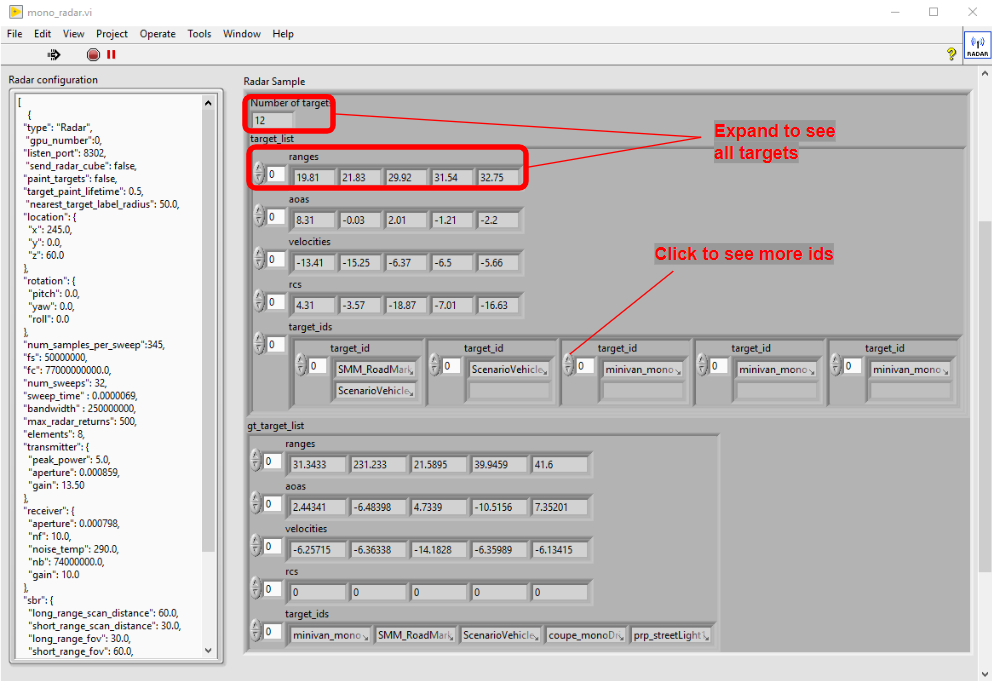

## mono_radar.vi

### Description
Configure and reads the stream data for the Radar sensor and outputs a cluster with the target list and the ground truth. 

### Inputs
- **error in (Error Cluster):** can accept error information wired from VIs previously called. Use this information to decide if any functionality should be bypassed in the event of errors from other VIs.

### Outputs
- **Radar configuration(String):** Settings specific for the Radar detection.
- **Raw data:** The data without parsing. Output directly from the sensor.
- **Radar Data Cube (String):** Only send if, **send_cube** is set to **true** on the **Radar configuration**. Raw data for a cube of dimensions M (number of array antenna inputs) by L (number of range bins in fast time) by N (number of pulse in CPI in slow time).
- **Radar Sample (Cluster):** Cluster with the processed data for the Radar sensor.

| Type  | Name   | Units   |
| ------------ | ------------ |------------ |
|I32  | time_stamp | seconds |
|SGL | game_time  | seconds |
|Cluster | target_list  | See below |
|Cluster | gt_target_list  | See below|

**Cluster - target_list**  

| Type  | Name   | Units   |
| ------------ | ------------ |------------ |
|1D Array SGL | ranges  | meters |
|1D Array SGL  | aoa_list | degrees |
|1D Array SGL | velocities | m/s |
|1D Array String | target_ids |  |

**Cluster - gt_target_list**  

| Type  | Name   | Units   |
| ------------ | ------------ |------------ |
|1D Array SGL | ranges  | meters |
|1D Array SGL  | aoa_list | degrees |
|1D Array SGL | velocities | m/s |
|1D Array String | target_ids |  |

- **error out (Error Cluster):** can accept error information wired from VIs previously called. Use this information to decide if any functionality should be bypassed in the event of errors from other VIs.

## Front Panel for mono_radar.vi 

    

	

&nbsp;

