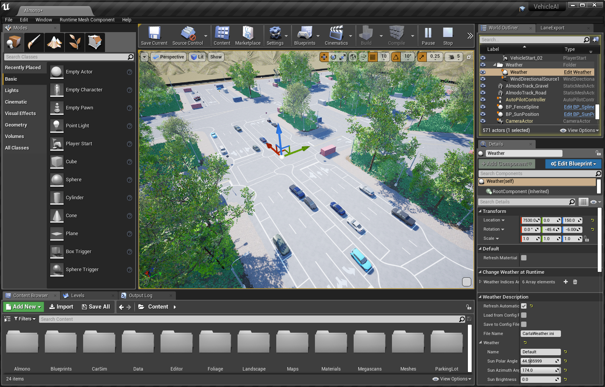

# monoDrive Documentation

Welcome to monoDrive's documentation.

This home page contains an index with a brief description of the different sections in the documentation. Feel free to read in whatever order preferred.

monoDrive's Platform is available now: [Download Monodrive](https://lumen.ni.com/nicif/US/GB_EVALTLKTLVMONODRIVE/content.xhtml)

## Getting Started

[Introduction](intro_information.md) -- Making autonomous vehicles drive safe 
[Quick Start](Getting_Started.md) -- Get monoDrive's Platform

## Products

[Simulator](Simulator.md) -- Test AV algorithms in one of several pre-made monoDrive Simulator levels.  
[Scenario Editor](scenario_editor/scenarios.md) -- Create and control various different aspects of AI vehicle behavior. 
[Real to Virtual](r2v/about.md) -- Collecting real-world data from cameras, LiDAR, and GNSS systems to create high-fidelity assets and maps usable in the Unreal Engine and the monoDrive Scenario Editor.

## Configurations
The monoDrive simulator is configured from the Client. Everything about the simulator can be configured, from the material properties, to these properties.

[Sensors](monoDrive_home/Common.md)  
[Vehicles](monoDrive_home/Vehicle-Configuration.md)  
[Weather](monoDrive_home/Weather.md)

## Build monoDrive

[LabVIEW Client](LV_client/quick_start/LabVIEW_client_quick_start.md)  
[Python Client](python_client/quick_start.md)  
[C++ Client](cpp_client/cpp_quick_start.md)

## Tutorials

[LabVIEW](LV_client/tutorials/Setup.md)  

