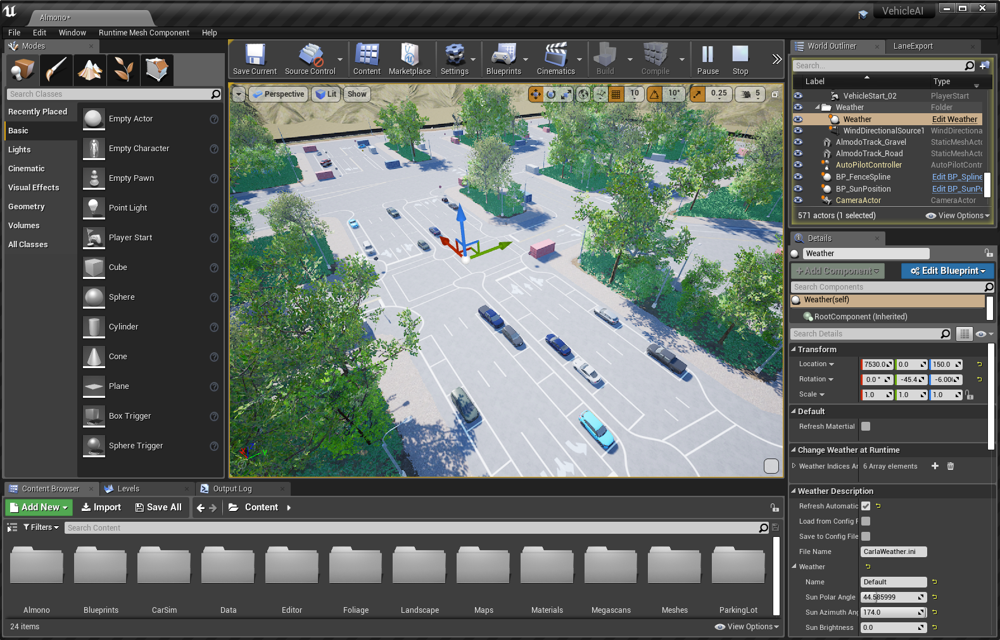

# monoDrive Documentation

Welcome to monoDrive's documentation.

This home page contains an index with a brief description of the different sections in the documentation. 

The documentation reflects the newest version of the monoDrive Simulation and Scenario Editor with Unreal Engine 4.25.4. We are excited to share our new features including a [Scenario Tool Widget](scenario_editor/scenarios.md) to easily load and save scenario files to run in Closed Loop mode, enhanced streaming, a new mode-Closed Loop Fixed Time Step, and new/updated sensors- a [waypoint sensor](monoDrive_home/Waypoint-Sensor.md) and [fisheye & wide angle lens camera models](monoDrive_home/Camera.md).

monoDrive's Platform is available now: [Download monoDrive](https://www.monodrive.io/register)

    
    

    

## About monoDrive

[Introduction](intro_information.md) -- Making autonomous vehicles drive safe 
[Getting Started](Getting_Started.md) -- Get monoDrive's Platform

## Products

[Simulator](Simulator.md) -- Test AV algorithms in one of several pre-made monoDrive Simulator levels.  
[Scenario Editor](scenario_editor/scenarios.md) -- Create and control various different aspects of AI vehicle behavior. 
[Real to Virtual](r2v/about.md) -- Collecting real-world data from cameras, LiDAR, and GNSS systems to create high-fidelity assets and maps usable in the Unreal Engine and the monoDrive Scenario Editor.

## Simulator API

[Simulator API Commands](monoDrive_home/Simulator-Commands.md)  

The monoDrive simulator is configured from a client. Everything about the simulator can be configured, from the material properties, to these properties.

[Simulator](monoDrive_home/Simulator-Configuration.md)  
[Sensors](monoDrive_home/Common.md)  
[Vehicles](monoDrive_home/Vehicle-Configuration.md)  
[Weather](monoDrive_home/Weather.md)

## Build monoDrive

[LabVIEW Client](LV_client/quick_start/LabVIEW_client_quick_start.md)  
[Python Client](python_client/quick_start.md)  
[C++ Client](cpp_client/cpp_quick_start.md)

## Instructions & How-tos

<a href="https://docs.google.com/document/d/1CNKV6uH6LYNShUDCY0I2ScNnKuVzvCVtPHe4Pv_Hcs0/edit?usp=sharing" target="_blank">New Vehicle Model Reduction & Import/Export to UE4</a>

## Tutorials

[LabVIEW](LV_client/tutorials/Setup.md)  
[Unreal Engine Tutorials](unreal_tutorials/MayaWheels.md)  
